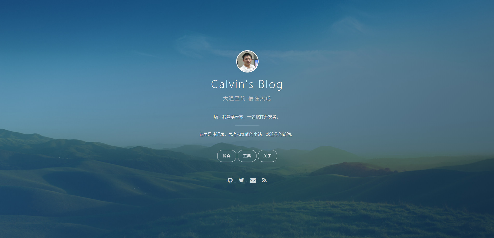
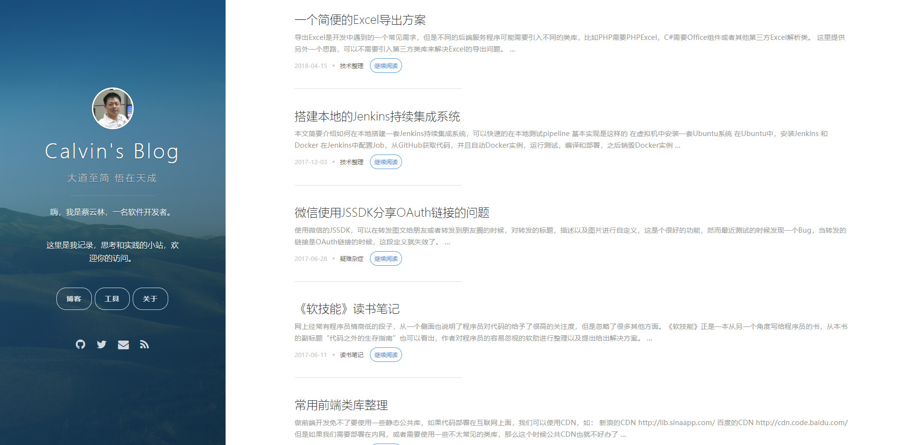
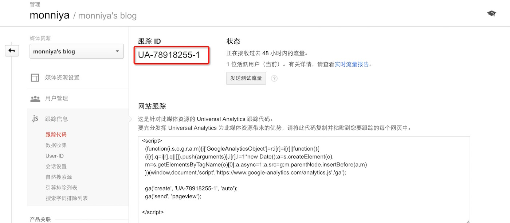
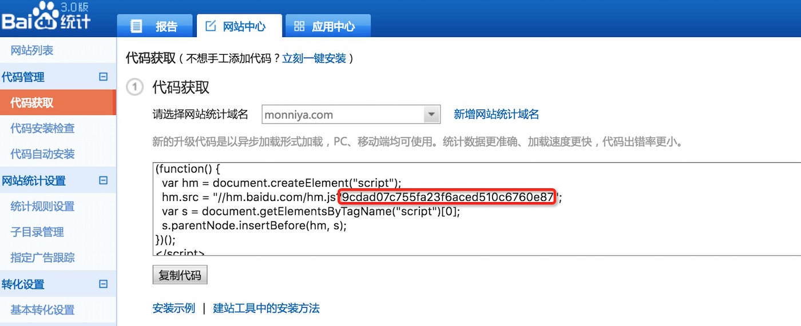

hexo-theme-vno
========

这个主题是原创为[onevat的vno](https://github.com/onevcat/vno), 它遵从简洁和响应式的设计风格，拥有一个独立的封面，易于集成的 Disqus 评论和多说系统，Google Analytics,字体图标以及多种颜色。

此主题为基于Hexo的vno主题，是由monniya的new-vno [github地址](https://github.com/monniya/hexo-theme-new-vno.git) 复刻而来，因为多说评论系统已经关闭，我增加了基于Valine评论系统，并修复了部分不蒜子阅读统计不显示以及其他一些小bug。

## Demo Show

[Demo: 我的博客](https://caiyunlin.com)





## 封面

### 图片和颜色

将您的封面图片放到主题的 source/images/ 下，将图片文件改名为background-cover.jpg或修改_config.iml中background的cover字段值即可。您也可以改变封面的颜色。找到_config.iml中background的color字段值,然后替换成您需要的颜色即可。默认为您提供了七种选择：

* `cover-blue` - #2568A3
* `cover-green` - #156F78
* `cover-purple` - #493252
* `cover-red` - #E25440
* `cover-orange` - #FB9C50
* `cover-slate` - #3D4260
* `cover-disabled` - 透明

### 头像和简介

头像可以在封面中显示,将头像文件放到全局的 source/images/下, 修改_config.yml中的logo字段值即可。

您还可以在封面页上写一个简短的介绍, 填写全局的_config.yml(注意:不是主题下的_config.yml)中的description字段值, 支持html标签。


## Installation

### Install 安装

``` bash  
$ git clone https://github.com/cylin2000/hexo-theme-vno.git themes/vno
```

### Enable 主题启用设置

设置全局的<code>_config.yml</code>
theme: vno

## Configuration 主题设置
设置主题的配置文件：<code>_config.yml</code>

```yml
# menu子菜单，可自定义
menu:
  #Archives: /archives
  工具: /apps/
  关于: /about/
  #我是: /aboutme
# rss需安装插件hexo-generator-feed
rss: /atom.xml
# description配置内容会出现在meta标签中，因此会被搜索引擎抓取
description: 

# 不填写的链接则不显示
social:
  weibo: https://weibo.com/cylin2000
  github: https://github.com/cylin2000
  stack_overflow: 
  facebook: 
  twitter: 
  google_plus: 
  email:

page_comment: true

# 封面中的头像
logo: /images/avatar.jpg
background:
  cover: /images/background-cover.jpg
  color: cover-purple

archive_date_format: MMM DD
fancybox: true

# 多说的帐号名, 不配置则不启用，使用disqus请去全局_config.yml中配置disqus_shortname
duoshuo_shortname: 

# Valine评论系统，app_id和app_secret获取方法参考 https://valine.js.org/quickstart.html
valine_app_id: 
valine_app_secret: 

google_analytics: 谷歌跟踪ID
baidu_tongji: 百度统计识别码
favicon: /images/avatar-small.png
```
谷歌跟踪ID：

百度统计识别码：


### 文章

喵神没有设置categories，只用tags
例如：
```yml
---
title: 文章名称
date: 2016-03-03 10:46:46
tags: 分类
---
```


### 数学公式支持

# mathjax
mathjax: true
由于资源考虑，默认是不加载mathjax的，若需使用请在文章头部添加：
```yml
如下示例：
---
title: 侧耳倾听我的心
date: 2017-02-18 22:55:08
tags: 观观影
mathjax: true
---
```